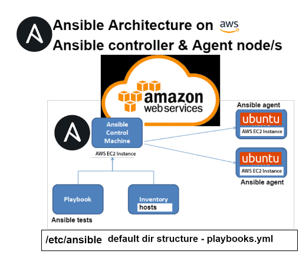

# Ansible Documentation

## Overview

Ansible is an open-source automation tool used for IT tasks such as configuration management, application deployment, and task automation. It is designed to simplify complex tasks and ensure consistent and repeatable IT operations. Ansible uses a simple, human-readable language called YAML for its playbooks, making it accessible to a wide range of users, from beginners to advanced engineers.

## Why Use Ansible?

- **Simplicity**: Ansible's YAML-based playbooks are easy to read and write, reducing the complexity of managing configurations and deployments.
- **Agentless**: Ansible operates without the need for agents on target machines, using SSH for communication, which simplifies the setup and reduces overhead.
- **Scalability**: It efficiently manages a large number of systems, ensuring that operations are consistent across all nodes.
- **Flexibility**: Ansible supports various platforms and can automate a wide range of tasks, from cloud provisioning to application deployment.

## How Ansible Works

Ansible operates using a control machine (the machine from which Ansible is run) and managed nodes (the machines that Ansible manages). The control machine uses SSH to communicate with the managed nodes, executing commands defined in playbooks.

### Key Components

1. **Playbooks**: YAML files containing the automation tasks to be executed.
2. **Inventory**: A list of managed nodes and groups of nodes.
3. **Modules**: The units of work executed by Ansible.
4. **Plugins**: Extend Ansible's core functionality.
5. **Roles**: Group tasks and other elements to simplify reuse and sharing.

## Ansible Directory Structure

By default, Ansible looks for its configuration and playbooks in `/etc/ansible` directory.

- **Playbooks**: `/etc/ansible/playbooks.yml`
- **Inventory**: `/etc/ansible/hosts`

## Diagram

Below is a visual representation of Ansible's architecture and workflow.




### Explanation of the Diagram

1. **Ansible Control Machine**: The primary machine where Ansible is installed and from which commands are executed. It can manage nodes in various environments, such as AWS EC2 instances.

2. **AWS EC2 Instance**: Represents a managed node in the AWS cloud. These instances are controlled by the Ansible Control Machine.

3. **Playbook**: A directory under the AWS EC2 Instance, containing Ansible playbooks and tests. The default directory structure for playbooks is `/etc/ansible/playbooks.yml`.

4. **Inventory Hosts**: Lists the managed nodes and their groups. The default inventory file is located at `/etc/ansible/hosts`.

5. **Ansible Agent**: An agentless model where Ansible uses SSH to manage Ubuntu instances on AWS EC2. These instances are further connected in a hierarchical manner, showing the potential for managing multiple layers of instances.

## Where to Use Ansible

Ansible is suitable for a variety of environments and use cases, including:

- **Cloud Provisioning**: Automating the setup of cloud infrastructure across platforms like AWS, Azure, and GCP.
- **Configuration Management**: Ensuring consistent configuration across multiple nodes.
- **Application Deployment**: Automating the deployment of applications, ensuring that each deployment is identical.
- **Orchestration**: Managing the execution order and dependencies of various automated processes.

By following the above structure and understanding the key concepts, you can effectively utilize Ansible for automating and managing IT tasks.


# Setting Up Ansible with EC2 Instances

This documentation covers the steps to set up three EC2 instances: one controller, one for the app, and one for the database. We will configure SSH access, install Ansible on the controller, and verify connectivity to the app and database instances using Ansible.

## Steps

### 1. Launch EC2 Instances

Launch three EC2 instances with the following roles:

- **Controller Instance**: This instance will have Ansible installed.
- **App Instance**: This instance will be managed by Ansible.
- **Database Instance**: This instance will also be managed by Ansible.

Ensure all instances are configured to allow SSH access on port 22.

### 2. SSH into the Controller Instance

SSH into the controller instance from your local machine:

```bash
ssh -i ~/.ssh/your_key.pem ubuntu@controller_ip_address
```

### 3. Update and Upgrade the Controller Instance

Once connected to the controller instance, run the following commands to update and upgrade the system:

```bash
sudo apt-get update
sudo apt-get upgrade -y
sudo apt install software-properties-common
```

### 4. Install Ansible on the Controller Instance

Install Ansible on the controller instance:

```bash
sudo add-apt-repository --yes --update ppa:ansible/ansible
sudo apt-get install ansible -y
```

### 5. Install `tree` Utility

Install the `tree` utility on the controller instance:

```bash
sudo apt-get install tree -y
```

### 6. Copy the SSH Key to the Controller Instance

From your local machine, use SCP to copy your SSH private key to the controller instance:

```bash
scp -i ~/.ssh/your_key.pem ~/.ssh/your_key.pem ubuntu@controller_ip_address:~/.ssh/
```

### 7. SSH from the Controller to App and Database Instances

On the controller instance, ensure the private key has the correct permissions:

```bash
chmod 400 ~/.ssh/your_key.pem
```

Try to SSH into the app and database instances from the controller:

```bash
ssh -i ~/.ssh/your_key.pem ubuntu@app_instance_ip
ssh -i ~/.ssh/your_key.pem ubuntu@db_instance_ip
```

### 8. Add App and Database Instances to Ansible Hosts File

Edit the Ansible hosts file on the controller instance:

```bash
sudo nano /etc/ansible/hosts
```

Add the following lines to the file:

```bash
[web]
ec2-instance-web ansible_host=3.255.207.158 ansible_user=ubuntu ansible_ssh_private_key_file=~/.ssh/your_key.pem ansible_port=22

[db]
ec2-instance-db ansible_host=34.240.235.51 ansible_user=ubuntu ansible_ssh_private_key_file=~/.ssh/your_key.pem ansible_port=22
```

### 9. Verify Connectivity with Ansible

Use Ansible to ping the app and database instances to ensure everything is set up correctly:

```bash
sudo ansible all -m ping
```

### 10. Additional Ansible Commands

Run the following additional commands to verify and manage your setup:

1. **Display directory structure using `tree`**:

    ```bash
    tree
    ```

2. **Check system information for web and db instances**:

    ```bash
    sudo ansible web -a "uname -a"
    sudo ansible db -a "uname -a"
    sudo ansible all -a "uname -a"
    ```

3. **Check memory usage for the web instance**:

    ```bash
    sudo ansible web -a "free"
    ```

4. **Check current date and time for web and all instances**:

    ```bash
    sudo ansible web -a "date"
    sudo ansible all -a "date"
    ```

5. **Update all instances**:

    ```bash
    sudo ansible all -a "sudo apt-get update -y"
    ```

6. **Create a test file on the controller**:

    ```bash
    sudo touch testing-controller.txt
    ```

7. **List files in the home directory of the web instance**:

    ```bash
    sudo ansible web -a "ls -a"
    ```

8. **Copy the test file to the web instance**:

    ```bash
    sudo ansible web -m copy -a "src=/home/ubuntu/testing-controller.txt dest=/home/ubuntu/testing-controller.txt mode=0644 owner=ubuntu group=ubuntu"
    ```

### Expected Output

The output should show successful responses from the various Ansible commands, indicating that the setup and file operations were successful.

## Conclusion

By following these steps, you will have set up a controller instance with Ansible, configured SSH access to both app and database instances, and verified connectivity using Ansible. This setup allows for efficient management and automation of your infrastructure.


# Ansible Playbook Documentation

## Introduction

Ansible is an open-source automation tool that allows you to automate tasks such as configuration management, application deployment, and orchestration. Ansible uses YAML-based playbooks to define sets of tasks to be executed on remote hosts.

## Ansible Playbooks

### Structure

Ansible playbooks are written in YAML format and start with three dashes (`---`). Playbooks consist of a series of plays, where each play defines tasks to be executed on specific hosts. Each task within a play defines a specific action to be performed, such as installing a package, copying files, or running commands.

### Example Playbooks

#### Nginx Installation Playbook

```bash
---
# creating a playbook to install/configure nginx in the web server

# YAML starts with three dashes

# add the name of the host web
- hosts: web

# see the logs gather facts
  gather_facts: yes

# provide admin access - sudo
  become: true

# add instructions to install nginx on the web server
  tasks:
  - name: Installing Nginx web server
    apt: pkg=nginx state=present
```

To run this playbook:
```bash
sudo ansible-playbook nginx-play.yml
```

Node.js Application Deployment Playbook:
```bash
---
- hosts: web
# shows logs while the script is running
  gather_facts: yes
# provide sudo permission
  become: true
 # install node
  tasks:
    - name: Installing Node.js
      apt:
        name: nodejs
        state: present
         
  tasks:
    - name: Update and upgrade apt packages
      apt:
        upgrade: yes
        update_cache: yes
        cache_valid_time: 86400 #One day

## install npm
    - name: Installing npm
      apt:
        name: npm
        state: present
 
    - name: download latest npm + Mongoose
      shell: |
        npm install -g npm@latest
        npm install mongoose@ -y
 
## update and upgrade agent node
  tasks:
  - name: Update and upgrade apt packages
    apt:
      upgrade: yes
      update_cache: yes
      cache_valid_time: 86400 #One day
 
## clone app
 
  - name: clone app github repository
    git:
      repo: https://github.com/Luix-Sparta/tech258_cicd
      dest: /app
      clone: yes
      update: yes
## install pm2
  - name: install pm2
    shell: |
      cd /app/app
      npm install -y
      npm install pm2@4.0.0 -g
 
## launch app with pm2
  - name: launch app with pm2
    shell: |
      cd /app/app
      pm2 kill
      pm2 start app.js

```
Version 2:
```bash
---
# YAML starts with three dashes

# add the name of the host web
- hosts: web

# see the logs gather facts
  gather_facts: yes

# provide admin access - sudo
  become: true

# add instructions to install nginx on the web server
  tasks:
    - name: Installing Nginx web server
      apt: pkg=nginx state=present
      # ensure nginx is in a running state

    - name: Installing Node.js and npm
      apt:
        name:
          - nodejs
          - npm
        state: present

    - name: Update and upgrade apt packages
      apt:
        upgrade: yes
        update_cache: yes
        cache_valid_time: 86400 #One day

#    - name: download latest npm + Mongoose
#      shell: |
#        npm install -g npm
#        npm install mongoose@ -y

    - name: clone app github repository
      git:
        repo: https://github.com/Luix-Sparta/tech258_cicd
        dest: /app
        clone: yes
        update: yes

    - name: install npm & pm2
      shell: |
        cd /app/app
        npm install -y
        npm install pm2@4.0.0 -g

    - name: launch app with pm2
      shell: |
        cd /app/app
        pm2 kill
        pm2 start app.js

```
## Running Playbooks

To execute a playbook, use the ansible-playbook command followed by the playbook filename. For example:
```bash
sudo ansible-playbook nginx-play.yml
```

## Conclusion
Ansible playbooks provide a powerful way to automate tasks and manage infrastructure. By defining tasks in YAML format, Ansible enables easy configuration management, application deployment, and system orchestration.

