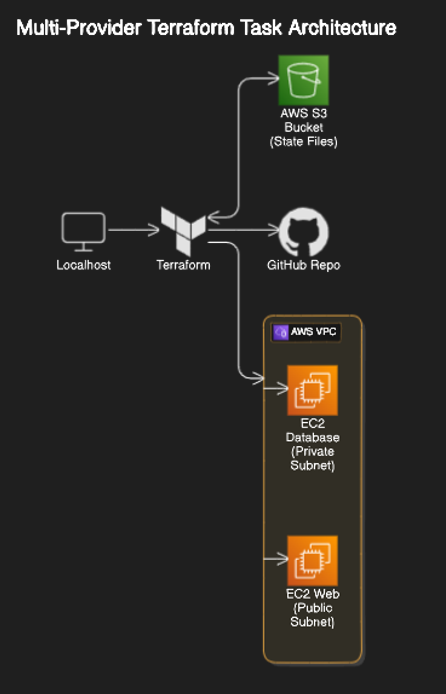

# Terraform Documentation

## What is Terraform?

Terraform is an open-source Infrastructure as Code (IaC) tool developed by HashiCorp. It allows users to define and provision data center infrastructure using a high-level configuration language. 

## Why Use Terraform?

Terraform enables users to manage and provision their infrastructure in a consistent and reproducible manner. By defining infrastructure as code, Terraform allows for version control, collaboration, and automation, which significantly reduces the risk of human error and improves the efficiency of managing resources.

## Benefits of Terraform

- **Infrastructure as Code (IaC)**: Facilitates infrastructure management using code, making it easier to version control and collaborate.
- **Automation**: Automates the provisioning and management of resources, reducing manual intervention.
- **Consistency**: Ensures that infrastructure configurations remain consistent across different environments.
- **Scalability**: Simplifies scaling infrastructure up or down based on requirements.
- **Integration**: Supports multiple cloud providers and services, offering flexibility in managing a hybrid infrastructure.

## Installation guide
Terraform works on CLI, use this guide to Install [Terraform](https://developer.hashicorp.com/terraform/tutorials/aws-get-started/install-cli).

## File Format

Terraform configuration files use HashiCorp Configuration Language (HCL) and follow a key-value syntax. These files typically have a `.tf` extension.

```bash
provider "aws" {
    region = "eu-west-1"
}

resource "aws_instance" "app_instance" {
    ami                    = "ami-02f0341ac93c96375"
    instance_type          = "t2.micro"
    associate_public_ip_address = true
    tags = {
        Name = "lui-terraform-tech258-app"
    }
}
```

### Init, Plan, Apply, Destroy

- **`terraform init`**: Initializes a working directory containing Terraform configuration files. This command downloads necessary plugins and sets up the backend.

- **`terraform plan`**: Creates an execution plan, showing what actions Terraform will take to achieve the desired state defined in the configuration files. It helps to verify the changes before applying them.

- **`terraform apply`**: Applies the changes required to reach the desired state of the configuration. It provisions or modifies the infrastructure accordingly.

- **`terraform destroy`**: Destroys the infrastructure managed by the configuration files. It is used to clean up and remove all resources defined in the configurations.

### AWS Environment Variables

You can use AWS environment variables to configure Terraform to use AWS credentials without hardcoding them directly in your configuration files. This approach enhances security and flexibility, especially when working in a team or across different environments.

To set AWS environment variables for Terraform, you can use the following:

```bash
export AWS_ACCESS_KEY_ID="your-access-key-id"
export AWS_SECRET_ACCESS_KEY="your-secret-access-key"
export AWS_DEFAULT_REGION="your-preferred-region"
```
Replace "your-access-key-id", "your-secret-access-key", and "your-preferred-region" with your actual AWS credentials and preferred region. Terraform automatically detects these environment variables and uses them to authenticate with AWS when executing commands like terraform plan and terraform apply.

Make sure to set these environment variables in your terminal session or in your CI/CD environment before running Terraform commands.

### AWS Credentials Warning

```bash
# aws-access-key-id = MUST NOT HARDCODE THE KEY
# aws-secret-access-key = MUST NOT HARDCODE THE KEY
# MUST NOT PUSH ANYTHING TO GITHUB UNTIL WE HAVE CREATED A .gitignore FILE TOGETHER.
```

**Important**: Never hardcode AWS credentials directly in your Terraform files. Always use environment variables or a secrets management service to securely manage your keys.

### Example: Launch an EC2 Instance on AWS

Below is an example Terraform configuration to create a service on the cloud by launching an EC2 instance on AWS.

```bash
# Define the AWS provider and region
provider "aws" {
    region = "eu-west-1"
}

# Define the EC2 instance resource
resource "aws_instance" "app_instance" {
    ami                    = "ami-02f0341ac93c96375"  # Specify the AMI to use
    instance_type          = "t2.micro"              # Specify the instance type
    associate_public_ip_address = true               # Associate a public IP address
    tags = {
        Name = "lui-terraform-tech258-app"     # Tag the EC2 instance
    }
}
```

### HCL Syntax

Terraform configuration files use HCL (HashiCorp Configuration Language), which follows a simple key-value format. Here’s an example:

```bash
key = "value"
```

Ensure that you do not push any configurations containing sensitive information to version control systems such as GitHub until a `.gitignore` file is set up to exclude sensitive files.

### AWS Provider Configuration

The `provider` block is used to define the AWS provider and specify the region for resource deployment.

```bash
provider "aws" {
    region = "eu-west-1"
}
```

### EC2 Instance Resource

The `resource` block defines the AWS EC2 instance. It includes attributes like `ami`, `instance_type`, `associate_public_ip_address`, and `tags`.

```bash
resource "aws_instance" "app_instance" {
    ami                    = "ami-02f0341ac93c96375"
    instance_type          = "t2.micro"
    associate_public_ip_address = true
    tags = {
        Name = "lui-terraform-tech258-app"
    }
}
```
## Terraform Configuration Files

### `variables.tf`
#### Purpose of Variables

Variables in Terraform allow you to parameterize your configuration, making it more flexible and reusable. They provide a way to input values dynamically, allowing users to customize deployments without modifying the underlying configuration.


**Snippet from variables.tf:**
```bash
# Create Variables to be used in main.tf

variable "app_ami_id" {
    description = "The AMI ID for the application instance"
    default     = "ami_id"
}

variable "key_name" {
    description = "The key name to use for the instance"
    default     = "key"
}

variable "region_name" {
    description = "The AWS region to deploy resources in"
    default     = "region"
}
```
### `main.tf`

#### Purpose of `main.tf`

The `main.tf` file contains the main configuration for your Terraform deployment. It defines the infrastructure resources to be provisioned, their properties, and any associated configurations such as security groups, subnets, and instances.


**Snippet from main.tf:**
```bash
```
provider "aws" {
    region = var.region_name
}

# Create a VPC
resource "aws_vpc" "vpc" {
    cidr_block = var.vpc_cidr_block

    tags = {
        Name = var.vpc_name
    }
}

# Create two subnets within the VPC
resource "aws_subnet" "app_subnet" {
    vpc_id            = aws_vpc.vpc.id
    cidr_block        = var.app_subnet_cidr_block
    availability_zone = var.app_subnet_availability_zone

    tags = {
        Name = var.app_subnet_name
    }
}

resource "aws_subnet" "db_subnet" {
    vpc_id            = aws_vpc.vpc.id
    cidr_block        = var.db_subnet_cidr_block
    availability_zone = var.db_subnet_availability_zone

    tags = {
        Name = var.db_subnet_name
    }
}
```


### GitHub Best Practices

To ensure sensitive files such as `variables.tf` and Terraform state files are not pushed to GitHub, create a `.gitignore` file in the root directory of your project with the following content:

```bash
# .gitignore file

# Ignore Terraform state files
*.tfstate
*.tfstate.backup

# Ignore variable files
variables.tf

# Ignore .terraform directory
.terraform/

# Ignore any other sensitive files
*.tfvars
terraform.tfvars
```

### Terraform Architecture and State Management

#### Terraform Architecture

1. **Configuration Files**: Written in HCL, defining the desired state of infrastructure.
2. **Terraform CLI**: Command-line interface to execute commands like `init`, `plan`, `apply`, and `destroy`.
3. **Providers**: Plugins to interact with APIs of cloud providers like AWS, Azure, GCP, etc.
4. **State File**: Keeps track of the current state of infrastructure resources.

#### Desired State vs. Current State

Terraform manages state by comparing the desired state (defined in configuration files) with the current state (tracked in the state file). When you run `terraform plan`, Terraform generates an execution plan showing the differences between the desired and current state. Running `terraform apply` will then reconcile these differences, ensuring the actual infrastructure matches the desired state.

#### Diagram


#### Diagram Description

1. **User writes configuration**: Using HCL to define infrastructure resources.
2. **Terraform CLI**: Executes `terraform init` to set up the environment.
3. **Terraform State**: Maintains a record of the infrastructure.
4. **Plan and Apply**: `terraform plan` shows proposed changes, and `terraform apply` enacts them.
5. **Providers**: Interface with cloud services to provision resources.
6. **Infrastructure**: The actual cloud resources managed by Terraform.


### Multiple Providers

Terraform allows you to use multiple providers within a single configuration file. This is useful when you need to manage resources across different cloud providers or services in a unified manner.

Here's an example of how you can use multiple providers in Terraform:

```bash
# Define the AWS provider
provider "aws" {
  region = var.aws_region
}

# Define the GitHub provider
provider "github" {
  token = var.github_token
}

# Create an AWS S3 bucket
resource "aws_s3_bucket" "example_bucket" {
  bucket = "example-bucket"
  acl    = "private"
}

# Create the GitHub repository
resource "github_repository" "iac_github_automated_repo" {
  name        = "IaC-github-automated-repo"
  description = "Automated repository creation with Terraform"
  visibility  = "public"
}
```

In this example:

- We define an AWS provider to manage AWS resources like S3 buckets.
- We define a GitHub provider to manage GitHub resources like repositories.
- We create an AWS S3 bucket using the AWS provider.
- We create a GitHub repository using the GitHub provider.

#### Generating GitHub Personal Access Token

To generate a GitHub personal access token, follow these steps:

1. Log in to your GitHub account.
2. Click on your profile icon in the top-right corner of the page and select "Settings" from the dropdown menu.
3. In the left sidebar, click on "Developer settings."
4. From the submenu, click on "Personal access tokens."
5. Click on the "Generate new token" button.
6. Enter a name for the token and select the necessary scopes or permissions (e.g., `repo` for creating repositories).
7. Click on the "Generate token" button.
8. Copy the generated token and store it securely.

#### Adding GitHub Token to Variables File

To use the GitHub personal access token in your Terraform configuration, add it to your variables file (`variables.tf` or any other file you use to declare variables):

```bash
variable "github_token" {
  description = "GitHub personal access token"
  type        = string
  default = "string"
}
```

#### How It Works

The provided Terraform configuration file defines two providers: AWS and GitHub. Each provider is configured with the necessary authentication details (e.g., AWS region, GitHub personal access token).

The configuration then creates resources using these providers. For example, it creates an AWS S3 bucket using the AWS provider and a GitHub repository using the GitHub provider. This demonstrates how you can manage resources across different providers within the same Terraform configuration file.


### Multi-Provider Terraform Architecture Documentation

This documentation provides a comprehensive explanation of a multi-provider Terraform architecture. The diagram and detailed descriptions below illustrate the setup and relationships between Terraform, AWS services, GitHub, and state management via an S3 bucket.

## Introduction

In this setup, we are using Terraform to manage and automate infrastructure provisioning across multiple providers, specifically AWS and GitHub. Terraform is a powerful tool for infrastructure as code (IaC) that allows us to define cloud resources declaratively and manage their lifecycle effectively. This architecture ensures that our infrastructure is consistently deployed and maintained across different environments.

### Architecture Diagram



### Code Explanation

### Providers Configuration

```
provider "aws" {
  region = "eu-west-1"
}

provider "github" {
  token = var.github_token
}
```

**Explanation**:  
- **AWS Provider**: Configures Terraform to use the AWS provider, setting the region to `eu-west-1`.
- **GitHub Provider**: Configures Terraform to use the GitHub provider, using a token stored in a variable.

### Backend Configuration (S3)

```
terraform {
  backend "s3" {
    bucket = "tech258-lui-terraform"
    key    = "dev/terraform.tfstate"
    region = "eu-west-1"
  }
}
```

**Explanation**:  
- **Backend Configuration**: Specifies that Terraform state files will be stored in an AWS S3 bucket. This centralized state management allows multiple team members to work on the same infrastructure efficiently.

### AWS Resources

#### VPC and Subnets

```
resource "aws_vpc" "app-vpc" {
  cidr_block = var.vpc_cidr_block

  tags = {
    Name = var.vpc_name
  }
}

resource "aws_subnet" "app-subnet" {
  vpc_id            = aws_vpc.app-vpc.id
  cidr_block        = var.app_subnet_cidr_block
  availability_zone = "eu-west-1a"

  tags = {
    Name = var.app_subnet_name
  }
}

resource "aws_subnet" "db-subnet" {
  vpc_id            = aws_vpc.app-vpc.id
  cidr_block        = var.db_subnet_cidr_block
  availability_zone = "eu-west-1a"

  tags = {
    Name = var.db_subnet_name
  }
}
```

**Explanation**:  
- **VPC**: Creates a Virtual Private Cloud (VPC) with a specified CIDR block.
- **Subnets**: Creates two subnets within the VPC:
  - **Public Subnet**: Used for the web application.
  - **Private Subnet**: Used for the database instance, enhancing security by isolating it from direct internet access.

#### Internet Gateway and Route Table

```
resource "aws_internet_gateway" "gw" {
  vpc_id = aws_vpc.app-vpc.id
}

resource "aws_route_table" "app-route-table" {
  vpc_id = aws_vpc.app-vpc.id

  route {
    cidr_block = "0.0.0.0/0"
    gateway_id = aws_internet_gateway.gw.id
  }

  route {
    ipv6_cidr_block = "::/0"
    gateway_id = aws_internet_gateway.gw.id
  }

  tags = {
    Name = var.route_table_name
  }
}
```

**Explanation**:  
- **Internet Gateway**: Provides internet access to resources within the VPC.
- **Route Table**: Defines routes to direct traffic from the VPC to the internet through the Internet Gateway.

#### Route Table Association

```
resource "aws_route_table_association" "a" {
  subnet_id      = aws_subnet.app-subnet.id
  route_table_id = aws_route_table.app-route-table.id
}
```

**Explanation**:  
- **Route Table Association**: Associates the route table with the public subnet, enabling internet connectivity for resources within that subnet.

#### Security Groups

```
resource "aws_security_group" "tech258-lui-allow-web" {
  name        = "allow_web_traffic"
  description = "Allow web traffic"
  vpc_id      = aws_vpc.app-vpc.id

  ingress {
    description = "HTTPS"
    from_port   = 443
    to_port     = 443
    protocol    = "tcp"
    cidr_blocks = ["0.0.0.0/0"]
  }

  ingress {
    description = "HTTP"
    from_port   = 80
    to_port     = 80
    protocol    = "tcp"
    cidr_blocks = ["0.0.0.0/0"]
  }

  ingress {
    description = "SSH"
    from_port   = 22
    to_port     = 22
    protocol    = "tcp"
    cidr_blocks = ["0.0.0.0/0"]
  }

  egress {
    from_port   = 0
    to_port     = 0
    protocol    = "-1"
    cidr_blocks = ["0.0.0.0/0"]
  }

  tags = {
    Name = "tech258-lui-allow-web"
  }
}

resource "aws_security_group" "tech258-lui-allow-db" {
  name        = "allow_db_traffic"
  description = "Allow database traffic"
  vpc_id      = aws_vpc.app-vpc.id

  ingress {
    description = "MongoDB"
    from_port   = 27017
    to_port     = 27017
    protocol    = "tcp"
    cidr_blocks = ["0.0.0.0/0"]
  }

  ingress {
    description = "SSH"
    from_port   = 22
    to_port     = 22
    protocol    = "tcp"
    cidr_blocks = ["0.0.0.0/0"]
  }

  egress {
    from_port   = 0
    to_port     = 0
    protocol    = "-1"
    cidr_blocks = ["0.0.0.0/0"]
  }

  tags = {
    Name = "tech258-lui-allow-db"
  }
}
```

**Explanation**:  
- **App Security Group**: Allows HTTP, HTTPS, and SSH traffic to the web instance.
- **DB Security Group**: Allows MongoDB and SSH traffic to the database instance.

#### EC2 Instances

```
resource "aws_instance" "db" {
  ami                    = var.db_ami_id
  instance_type          = "t2.micro"
  availability_zone      = "eu-west-1a"
  key_name               = var.key_name
  vpc_security_group_ids = [aws_security_group.tech258-lui-allow-db.id]
  subnet_id              = aws_subnet.db-subnet.id
  associate_public_ip_address = true

  tags = {
    Name = "tech258-lui-db"
  }
}

resource "aws_instance" "app" {
  ami                    = var.app_ami_id
  instance_type          = "t2.micro"
  availability_zone      = "eu-west-1a"
  key_name               = var.key_name
  vpc_security_group_ids = [aws_security_group.tech258-lui-allow-web.id]
  subnet_id              = aws_subnet.app-subnet.id
  associate_public_ip_address = true

  user_data = <<-EOF
                #!/bin/bash
                sudo apt update -y
                sudo DEBIAN_FRONTEND=noninteractive apt upgrade -y
                sudo DEBIAN_FRONTEND=noninteractive apt install nginx -y

                sudo sed -i '51s/.*/\t        proxy_pass http:\/\/localhost:3000;/' /etc/nginx/sites-enabled/default
                sudo systemctl restart nginx
                sudo systemctl enable nginx
                
                export DB_HOST=mongodb://${aws_instance.db.private_ip}:27017/posts

                curl -fsSL https://deb.nodesource.com/setup_20.x | sudo DEBIAN_FRONTEND=noninteractive -E bash - && sudo DEBIAN_FRONTEND=noninteractive apt-get install -y nodejs

                git clone https://github.com/Luix-Sparta/tech258-sparta-test-app
                cd /tech258-sparta-test-app/app

                sudo -E npm install

                sudo npm install -g pm2 -y
                pm2 stop app
                pm2 start app.js 
                sudo node seeds/seed.js
                EOF

  tags = {
    Name = "tech258-lui-app"
  }
}
```

**Explanation**:  
- **Database Instance**: Creates an EC2 instance for the MongoDB database within the private subnet.
- **Application Instance**: Creates an EC2 instance for the web application within the public subnet. The user data script:
  - Installs and configures NGINX.
  - Installs Node.js and application dependencies.
  - Clones the application repository and starts the application using PM2.

### GitHub Repository

```
resource "github_repository" "iac_github_automated_repo" {
  name        = "IaC-github-automated-repo"
  description = "Automated repository creation with Terraform"
  visibility  = "public"
}
```

**Explanation**:  
- **GitHub Repository**: Automates the creation of a GitHub repository using Terraform. This repository can be used to store and manage the Terraform code for the infrastructure.

## Conclusion

This architecture demonstrates how to use Terraform to manage infrastructure across multiple providers, including AWS and GitHub, with centralized state management stored in an S3 bucket. The setup ensures consistent and repeatable infrastructure deployments, enhancing collaboration and efficiency in infrastructure management.


## Conclusion

By using Terraform, you can efficiently manage and provision your infrastructure in a reliable and automated manner. Always remember to secure your credentials and use best practices for infrastructure management.


